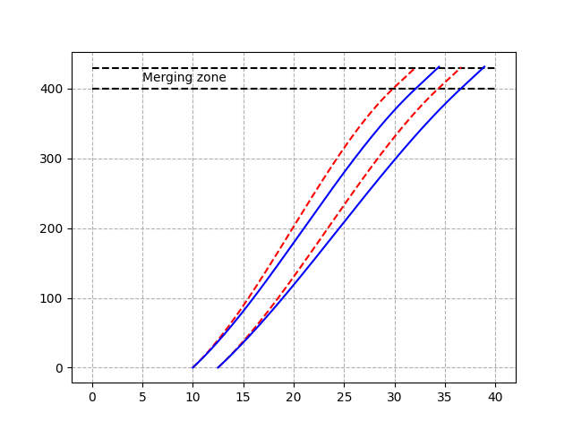
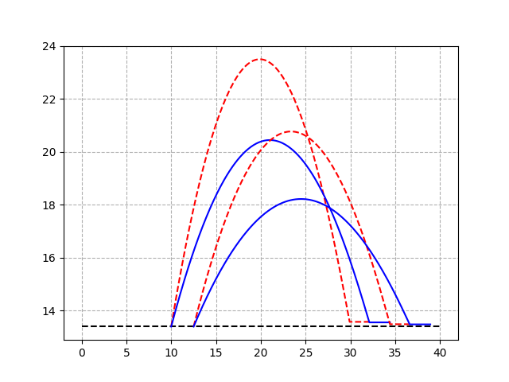
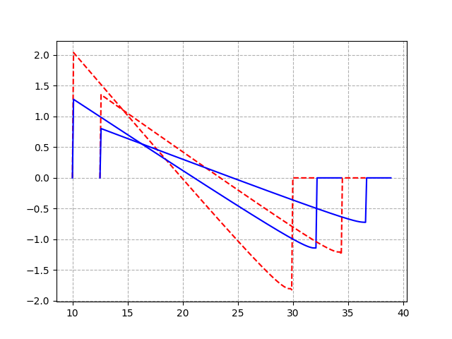
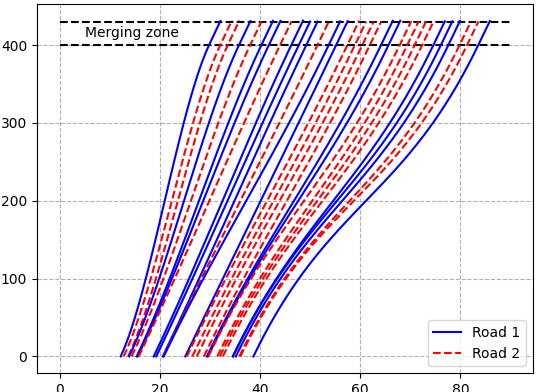
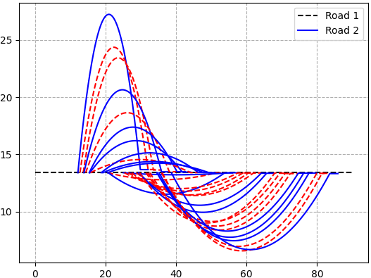
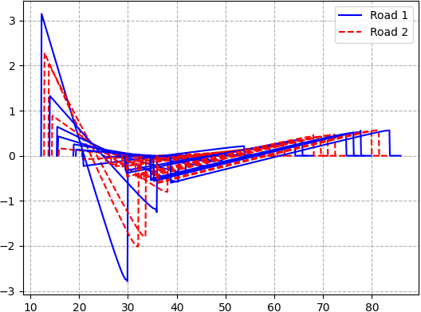
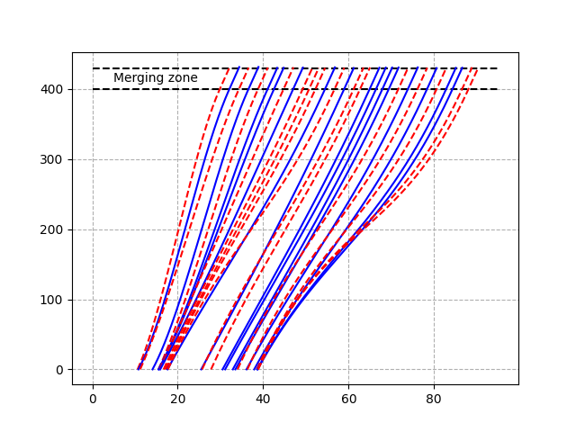
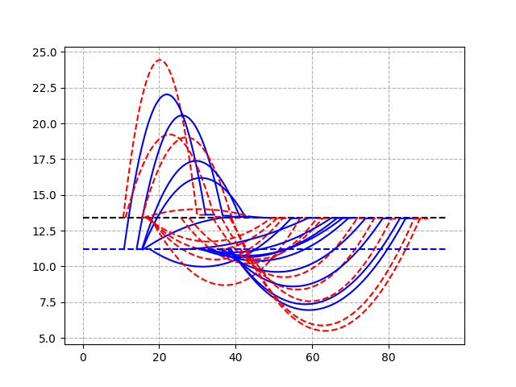
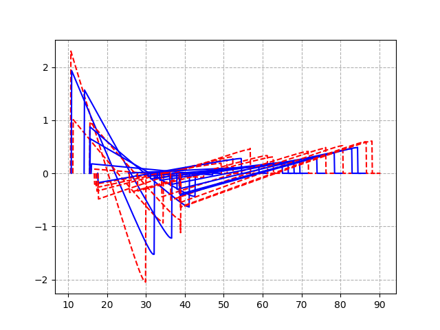

# On-ramp highway merging of Connnected and Automated Vehicles using Optimal Control

## The code is an implementation of the paper titled **"Automated and Cooperative Vehicle Merging at Highway On-Ramps"** written by *Rios-Torres, Jackeline; Malikopoulos, Andreas A.* as published in IEEE Transactions on Intelligent Transportation Systems

### Position, velocity, acceleration trajectories for 4 vehicles in the network

  

### Position, velocity, acceleration trajectories for 30 vehicles in the network

  

### Position, velocity, acceleration trajectories for 30 vehicles with different velocities for different roads

  

### Animation

